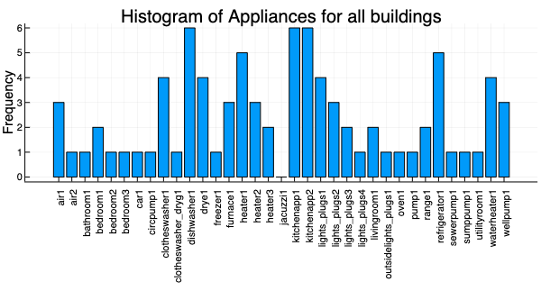

 <h1>ORIE 4741 Project Midterm Report</h1> 

 <h2>Alfredo Rodriguez (aar245)</h2> 

 <h2>November 8th, 2020</h2> 

<h2>1 Introduction</h2>

As energy utilities expand the deployment of smart meters in the US, privacy of personal data is acquiring greater concern. In the possession of an adversary, power consumption data could reveal a user’s residence occupancy and routine aggregate power and appliance usage trends. The expansion of the Ubiquitous Power Internet of Things (UPIoT), which oftentimes incorporates low-cost smart metering equipment and less secure data transmission, further increases privacy concerns. These privacy concerns create a lack of trust between UPIoT device users and device distributors, discouraging users from participating in large-scale energy feedback systems. Thus far, privacy has been explored in the context of home appliance manufacturing and Distributed Energy Resources, but to the best of my knowledge, very little work has been done to explore decentralized privacy in the context of energy disaggregation. Federated learning is a decentralized machine learning technique that trains a learning model on user’s devices locally without sharing personal data. In the context of the UPIoT, federated learning can be utilized as a means to better ensure user privacy. Specifically, in the context of energy disaggregation, wherein aggregate power consumption data are used to make predictions on appliance specific energy trends without the need for the installation of physical, oftentimes costly and intrusive appliance-level submetering equipment, federated learning creates an opportunity for UPIoT device users to feel secure in sharing data, enabling more contributors to develop energy disaggregation models while creating more generalized models.

<h2>2 Data Set</h2>

For the purpose of this study, I am exploring the Pecan Street Dataset through Dataport that offers circuit and grid-level power consumption data for more than 1,000 volunteer homes across the United States. Of these 1,000 homes, I currently have access to data for 79 of them in New York for the month of May, 2019. The dataset contains a column called "dataid", which allows me to differentiate between each building, as well as 1-minute interval timestamps for power consumption readings along with power consumption data measured in kiloWatts for 77 different metered devices. I also have access to a metadata file that explains the meaning of each device and classifies each of the 79 buildings by use-type; Single Family Home, Townhome or Apartment. I have recently requested a broader dataset that will grant me access to data from February, 2019 to October, 2020 for 104 homes in New York. Taking into account feedback from my proposal peer review suggesting I use a larger dataset, I believe this dataset will be more suitable for my purposes since it contains a larger and more diverse set of homes as well as 1-minute interval data for almost 2 years as opposed to 1 month.

<h2>3 Data Cleaning</h2>

At first glance, the dataset seemed very large and messy, with over 400,000 examples and 79 features. Looking deeper into the data, it seemed even messier, wherein each building submeters a different set of devices, creating many fields of missing data. For the purpose of testing an energy disaggregation model built using one building on other buildings, the same appliance must be compared and this disparity in devices created a challenge. In cleaning my data, I deleted any features that were filled completely with missing values, then changed any remaining missing values to 0. The feature of aggregate building power was not directly available at first and it was necessary to add grid power with any solar power submetered to obtain the feature "total aggregate building power". I created a function to separate buildings by "dataid" so that I could generate testing and training sets on individual households, since they cannot be created on all the data at once. I created the histogram displayed in Figure 1 to get an idea of the frequency of appliances available and found that "kitchenapp1", "kitchenapp2", and "dishwasher1" appeared most frequently amongst the buildings. 

Figure 1: Histogram of appliances submetered for all buildings

<h2>4 Preliminary Analysis</h2>

I experimented with creating a linear regression model for my initial analysis. I let X \in Rnx1 be my training feature for an individual house, consisting of the buildings "total aggregate building power". I let Y \in Rd be my training label, consisting of the buildings appliance level power consumption. I let w \in Rd be my linear model coefficients generated using ordinary least squares.

My linear regression model was generated for one building to predict the power consumption of "kitchenapp1" from the buildings total power consumption. 80% of the available data was used to create the training set while the remaining 20% was used to create the test set. The results seemed promising, producing a testing mean squared error of 0.00449 kW2 and a training mean squared error of 0.004187 kW2. However, after plotting my results, I observed the predictions relatively followed the appliance power consumption trend, but did not capture sudden spikes in power consumption. Additionally, for the majority of the time, the power consumption for this device was very low and close to zero, which I thought might be why the error was so low. To test if this was true, I built a different linear regression model on another device, "lights_plugs1", which are the lights in a building which tend to use power more often than kitchen appliances. To my surprise, they once again showed a low training and testing error of 0.00414 and 0.00559 kW2 respectively. Though the error was low, sudden spikes in power consumption again were not always captured correctly. 

<h2>5 Future Work</h2>

I want to continue exploring other methods to capture these spikes in power consumption. My overall goal is to create a model trustworthy enough for building managers to feel safe in its use, and this requires greater accuracy for these sudden spikes. I am considering making this into a binary classification problem, where device states of "on" and "off" are predicted, while incorporating a balanced error rate to penalize heavily on instances where the model incorrectly classifies. To avoid overfitting, I plan to perform cross validation with a subset of my data. This will be easier to achieve once I obtain the larger dataset of 104 buildings.

Additionally, my next step is to incorporate federated learning into my model. Aside from obtaining an accurate model for making energy disaggregation predictions, I want to be able to preserve user privacy when transmitting data from the UPIoT device user end to the device distributor that will perform the disaggregation. I plan to use the Tensorflow federated package to implement privacy preserving techniques, and then optimize the accuracy-privacy tradeoff to provide the user with the most accurate energy disaggregation data in the most privacy-respecting manner.

